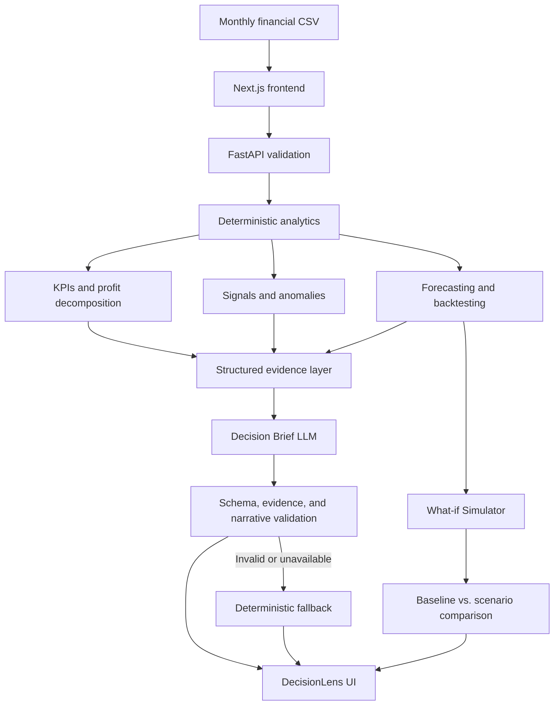

# DecisionLens AI

Evidence-backed financial decision intelligence for small businesses.

- **ForgeHacks Online 2026**
- **Track:** AI + Business
- **Live Demo:** [decisionlens-ai-five.vercel.app](https://decisionlens-ai-five.vercel.app)
- **Production API Docs:** [decisionlens-ai-api.onrender.com/docs](https://decisionlens-ai-api.onrender.com/docs)
- **GitHub:** [HivMindAI/decisionlens-ai](https://github.com/HivMindAI/decisionlens-ai)

## The Problem

Small-business owners may already have revenue and expense data but still struggle to determine what changed, what is affecting profitability, whether a movement is unusual, what may happen next, and how a hypothetical adjustment changes projected outcomes.

## The Solution

DecisionLens turns monthly financial data into a structured decision workflow:

**CSV → validation → deterministic financial analytics → profit-driver decomposition → business signals and anomalies → transparent forecasting → evidence-grounded Decision Brief → what-if simulation**

It is not simply “upload a CSV and chat with it.” Financial calculations happen in deterministic application code first. AI is used only to interpret a constrained evidence package after the numbers have been calculated and validated.

## Key Features

- Robust validation for required columns, dates, values, history length, and monthly continuity
- Business-health KPIs for revenue, profit, costs, and margins
- Arithmetic decomposition of changes in operating profit
- Statistical anomaly detection and deterministic business signals
- Three-month forecasts for revenue, COGS, and operating expenses
- Per-metric model selection through time-ordered historical backtesting
- Evidence-backed Decision Brief with validated citations and controlled next steps
- Live LLM integration with a useful deterministic fallback
- What-if Decision Simulator for explicit revenue and cost assumptions
- Visible assumptions, warnings, historical-error ranges, and limitations

## Why the AI Is Grounded

DecisionLens separates financial computation from language generation:

1. Deterministic code validates the dataset and calculates all business metrics.
2. The LLM does not calculate financial metrics and does not receive raw CSV rows.
3. Only an allowlisted, structured evidence context is sent to the provider.
4. Structured output restricts evidence IDs and next-step actions to application-controlled values.
5. Cited evidence IDs, output shape, action/evidence consistency, and qualitative narrative are validated again by the application.
6. Unsupported numeric claims and fabricated evidence are rejected.
7. Invalid or unavailable AI output falls back to an evidence-backed deterministic brief.

The production Decision Brief uses Groq-hosted `openai/gpt-oss-120b`. The model interprets verified evidence; it is not responsible for the underlying analytics, anomaly calculations, forecasts, or simulations.

## Architecture



## Data Contract

The uploaded CSV must contain:

| Column | Description |
| --- | --- |
| `date` | Monthly period |
| `revenue` | Non-negative revenue value |
| `cogs` | Non-negative cost of goods sold value |
| `operating_expenses` | Non-negative operating-expense value |

Requirements:

- Monthly data with at least 12 contiguous months
- One row per month
- Non-negative financial inputs
- Extra columns may exist, but current analytics ignore them
- Values are treated as financial units; DecisionLens does not assume a currency
- Synthetic or demo datasets should be labeled honestly

## Forecasting Approach

Revenue, COGS, and operating expenses are forecast separately. For each metric, DecisionLens evaluates:

- Naive last value
- Linear trend
- Seasonal naive when sufficient history exists

The application selects a model using time-ordered historical backtesting and mean absolute error (MAE). Gross profit, operating profit, and margins are then derived arithmetically from the component forecasts.

Displayed MAE-based ranges reflect observed historical backtest error. They are not probabilistic confidence intervals and do not guarantee future outcomes.

## What-if Decision Simulator

Users can adjust assumptions for:

- Revenue
- COGS
- Operating expenses

DecisionLens applies those adjustments to the baseline component forecast and compares resulting profit, margin, cumulative impact, and period-level outcomes.

This is deterministic scenario analysis. It is not causal inference and does not guarantee the real-world effect of a business decision.

## Tech Stack

| Area | Technologies |
| --- | --- |
| Frontend | Next.js, React, TypeScript, Tailwind CSS |
| Backend | Python, FastAPI, pandas, Pydantic, httpx |
| AI | Groq OpenAI-compatible API, `openai/gpt-oss-120b` |
| Infrastructure | Vercel, Render, GitHub |
| Testing | pytest, ESLint, Next.js production build verification |

## Run Locally

### Backend

```bash
cd backend
python -m venv .venv
```

Activate the environment:

```powershell
# Windows PowerShell
.\.venv\Scripts\Activate.ps1
```

```bash
# macOS or Linux
source .venv/bin/activate
```

Install and start the API:

```bash
pip install -r requirements.txt
uvicorn app.main:app --reload --port 8000
```

The API is available at `http://127.0.0.1:8000`.

### Frontend

In another terminal:

```bash
cd frontend
npm install
npm run dev
```

The frontend is available at `http://localhost:3000`.

`NEXT_PUBLIC_DECISIONLENS_API_URL` sets the API base URL used in the browser. For local development, copy the safe value from `frontend/.env.example`; production should set the deployed backend URL in the frontend hosting environment. This variable is intentionally public and is not a secret.

### Optional Live LLM

The backend works without an LLM configuration by returning the deterministic Decision Brief. To enable a compatible live provider, configure these environment-variable names in your runtime environment:

```text
DECISIONLENS_LLM_ENABLED
DECISIONLENS_LLM_BASE_URL
DECISIONLENS_LLM_API_KEY
DECISIONLENS_LLM_MODEL
DECISIONLENS_LLM_TIMEOUT_SECONDS
```

Use `backend/.env.example` as a placeholder-only reference. Never commit a real credential.

## Testing

Verified checks at the current project checkpoint:

- Backend: **117 passing pytest tests**
- Frontend lint: **passing**
- Frontend production build: **passing**

Backend tests cover CSV validation, analytics, forecasting, signals and anomalies, scenario simulation, AI grounding and fallback behavior, structured provider output, and CORS configuration. These checks are not a claim of complete production coverage.

## What Works

- CSV upload, validation, and analysis through the production frontend/backend integration
- Business-health KPIs, profit-change decomposition, signals, anomalies, and forecasting
- Production LLM Decision Brief with validated evidence and safe deterministic fallback
- Production What-if Simulator with baseline/scenario comparison and explicit limitations
- End-to-end production verification of the live Decision Brief and simulator

## Current Limitations

- Intended for monthly financial data
- Only `date`, `revenue`, `cogs`, and `operating_expenses` drive current analytics
- Forecasts extrapolate historical patterns and may not capture structural changes
- No causal inference
- Scenario adjustments are assumptions, not predictions of real-world decision effects
- No bank or accounting-platform integration
- No authentication, persistent user accounts, or stored user datasets
- The Render free service may cold-start after inactivity

## Project Structure

```text
decisionlens-ai/
├── frontend/
│   ├── src/app/          # Next.js App Router entry points and styles
│   ├── src/components/   # Analysis workspace and simulator UI
│   └── src/lib/          # API client and shared frontend types
└── backend/
    ├── app/models/       # API and domain models
    ├── app/services/     # Validation, analytics, forecasting, AI, and simulation
    └── tests/            # Backend regression and safety tests
```

## AI and Development Disclosure

AI coding assistants and LLMs were used during development. At runtime, the Decision Brief can use the configured external LLM. Deterministic calculations and business rules are implemented in the application, and AI-generated output is constrained and validated before it is shown.

## Hackathon Context

DecisionLens AI was built during **ForgeHacks Online 2026**, held **October 3–10, 2026**, for the **AI + Business** track.
